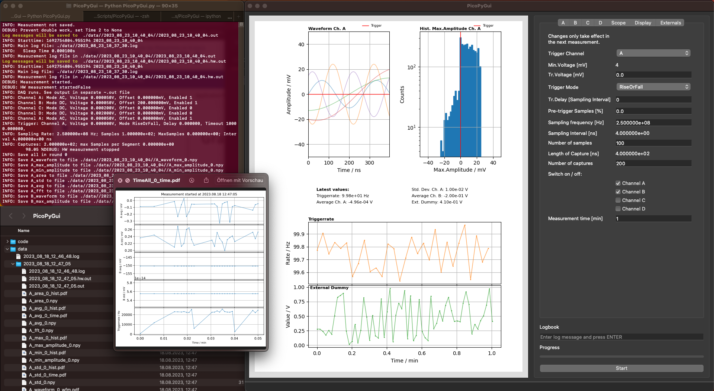

# PicoPyGui

Python GUI for Picoscope plus further hardware. 

Main purposes are: 
1) to do long duration measurements using the rapid block mode (i.e. missing as few triggers as possible and getting an acurate trigger rate)
2) live analyses (histograms, amplitudes, FFT)
3) merge picoscope data with external hardware to have all on the same time axis  

The following shows a screenshot of a full screen displaying:
* the program on the right with the plot area on its left and the settings for the scope on the right
* the console output on the upper left. Important messages are bold and colored.
* overview of data and plot files that are produced dependent on the chosen settings (lower right)
* one of the plots which are produced hourly: all data, of which the development over time can be displayed, is shown in one single plot for simple interpretation

I use this code to:
* characterise high gain, low dark rate photomultipliers for single photon counting
* measure the property of ice (luminescence, plasma light yield, etc) by adding many environmental sensors and slow control to this program (e.g. temperatures, humidity, high voltage, motors and switches controlled with Arduinos)
* communicate with and control a probe via a 2km long cable using RS485 custom protocol. The probe is used in a deep bore hole in Antarctic ice at temperatures down to -50°C. 
The probe is driven by a Red Pitaya Mini-oscilloscope which reads out a photomultiplier, controls high voltage, reads out environmental sensors (incl. gyroscope) and controls motors and cameras on Raspberry Pis (special code for long distance communication and Red Pitaya is not included here)

# Requirements
Hardware
* PC with Linux, Mac, Windows
* Picoscope 3xxxD or 6xxx (installing further scopes requires little programming skills)
* Further sensors / hardware (e.g. using serial communication with the PC) (installing hardware requires little programming skills)

Software
* Python3 with the following libraries: matplotlib, numpy, pyserial
* picoscope SDK needs to be installed from picotech website
* QT5
* PyQT5 (for GUI and threading, it is possible to run without GUI with limited functionality)

# Usage

## Preparations:
* Connect the scope and your hardware to your computer. 
* Add the required scripts to drive scopes or hardware which is not yet supported (see hints below). 
* Remove hardware code, which I added, but you don't need
* Add code to get your custom live analysis plotted in the display (MANUAL TODO)
Note: the program has dummy data for the scope and a dummy sensor added. This can be used for programming and debugging custom code. 

## Start

### With GUI
1) Start in the Terminal with 
* python3 PicoGui.py [--options]
2) Change the settings of the channels and external hardware first. Then decide on the trigger and scope settings. Decide if you want to have a limited measurement time or run continously. Finally choose what you want to have in live display. (The latter can be changed at run time, too.)
3) Start the measurement with the start button. Keep the terminal output visible as possible errors are shown there in red. Only major errors will stop the measurement.
4) During the measurement a log is written. You can add manual log entries (e.g. notes on the setup etc.) in the text box above the start button and press ENTER to have them saved. Later you can scan the log file and search for "LMSG" to find the manual entries. External hardware write log entries into a second log file. The third log file is for the App and is used when no measurement is running. 
5) Stop the measurement with the stop button or wait until the chosen time has passed
6) If the measurement duration was less than an hour, the program asks, whether you want to save the measurement. You also get a last chance to add a comment into the log. If you choose NO, the data directory and log files are deleted. If you choose YES, the data is saved and the App log file is copied into the measurement's directory, so that you have all info together. I recommend to add a more usefull name to the directory. 
7) If the measurement duration passes 1 hour, the data is saved, plots of the data are produced and the measurement is started anew. This means that you can only see the live data since the last saving time. 

### Without GUI 
1) Change the settings in settings.cfg according to your needs. 
2) Then start in the Terminal with (NOT TESTED!)
* python3 PicoGui.py -k [--options]
Most of the options from the GUI are not available, for the rest refer to that paragraph. 

### Notes on the operation
* this program always uses rapid block mode as in the presumed operations there is no need for slow data taking
* this program always requires a trigger condition
* make sure that you see the terminal output during operation and check all errors!
* make sure that one set of captures takes at least 1 sec. Then the time uncertainty is < 1%. This issue arises from the time interval in which the app checks if the picoscope is done with getting the set of captures. It is set to 0.1 millisecond. Our investigation shows that a modern PC should be very accurate down to 10 microsecond, but this seems to busy for this app.
* the deadtime of the 3406D seems to be around 2.2 microseconds, see below. This means that you cannot take rate measurements savely for >> 10 kHz. 
* data is not automatically saved. The user can decide when stopping the measurement. However, after 1 hour the data is saved hourly automatically. Per measurement a new directory is created and data and figures are saved there.
* you can choose to terminate measurement after a certain number of minutes. If you choose 0 min, the measurement will continue until you manually stop
* all values of the tab "Display" can be changed live during a run, so all values can be checked live
* user log entries can be entered anytime in the text input above the start/stop button
* USB hardware has to be plugged in before booting the program. If you remove it, also reboot the program!

# How to add external hardware 

In order to measure with external sensors, apart from the picoscope, within the same program and display the results on the same time axis, you need to provide a script which outputs the values once executed. 
Search in the code for the string "HWT" to find all locations where you need to add special code in order to add your external sensors.
List of what to do:
* script reading out the sensor in code/sensors
* in settings.cfg add a variable with name useSENSORNAME and add a bool 
* add user choice for this variable in code/config/hw.py 
* add choice in code/config/display.py for time and str wise display (need to change much more code if you want to see waveform or histogram)
* import your hardware script in code/sensors/main.py and add the code as marked with "HWT"
* in code/graph add the connection to code/sensors/main.py with linking the data array. Also give name and units. 
* in code/hplot.py add the units at the "HWT" labeled points
There are at least 2 examples in the current code: a dummy giving random numbers out and a photodiode which is read out by an arduino nano. The arduino is read out with serial connection.  

# How to support or add other picoscopes
* copy picoscopeXXXX.py to picoscopeNNNN.py where XXXX is one of the existing scripts and NNNN is the new name
* replaced all psXXXX with psNNNN
* check and possibly add or remove functionality (e.g. DC50 coupling)
* change numbers in timebase functions according to values in the picoscope programmers guide

# How to measure deadtime
* TODO

# Major changes from previous version
This is the previous version: https://github.com/Annalein214/picogui
It grow to large and was hard to maintain. New version should be simpler with even more features.
* sleeptime for a run is set to 0.1ms instead of 1ms in order to improve accuracy for the rate measurement
* time is exchanged by time_ns in order to improve accuracy for the rate measurement

# Todo list (please contect me for more items)
* test konsole mode
* combine picoscope types to one class with sub-classes implementing the changes
* make it possible to change properties of plots live (e.g. number of ticks etc when matplotlib makes stupid stuff)
* fft currently disabled
* check pyqtgraph, could be nicer

# Missing features
* Digital Ports on ps3000a not working yet
* this program does not include signal generator functionality

